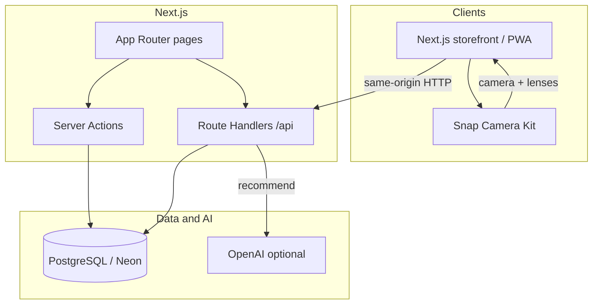
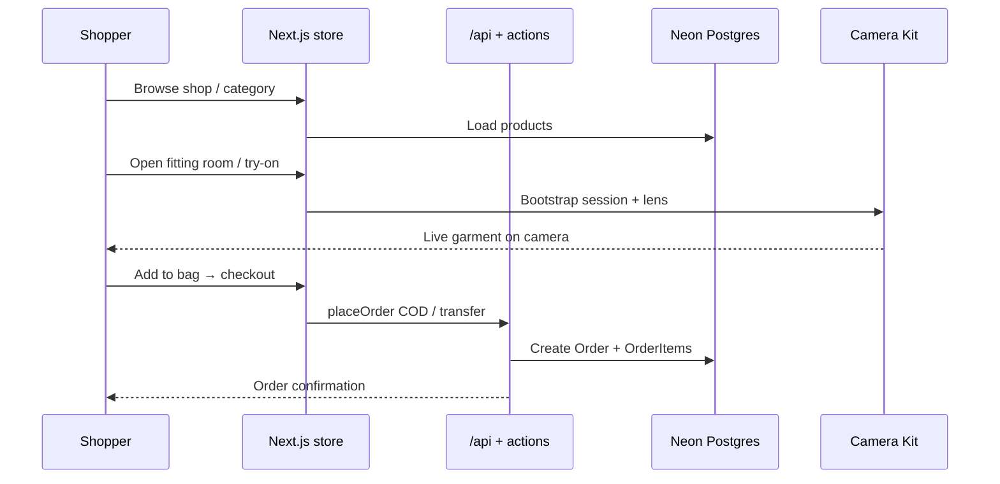

## Hook

See the hoodie on you before it ships — Vela is a fashion store with a live camera fitting room, not another grid of flat photos.

---

## The problem

Most fashion sites still ask you to buy from flat photos and hope the fit works when the box arrives. Try-on is either missing, stuck in a native app, or bolted on as a gimmick. I built Vela as a fashion house for hoodies, tees, trousers, and frames — with a live camera fitting room, cash-on-delivery checkout, AI styling hints, and a phone-installable PWA — so you see the piece on you before you order.

---

## My role

Solo full-stack developer. I designed and built the product end to end: Next.js storefront and admin, Prisma / PostgreSQL catalog and orders, Snap Camera Kit try-on, Serwist PWA, OpenAI-backed recommendations with a catalog fallback, Docker local Postgres, and production deploy on Vercel + Neon.

---

## Tech stack

- Next.js
- React
- TypeScript
- Tailwind CSS
- Prisma
- PostgreSQL
- Neon
- Docker
- Snap Camera Kit
- Serwist (PWA)
- OpenAI (optional)
- Vercel
- Git / GitHub

Next.js 15 (App Router) serves the storefront, admin, and `/api`. Prisma talks to PostgreSQL. Locally, Docker Compose runs Postgres; production uses Vercel + Neon (pooled `DATABASE_URL` + direct `DIRECT_URL`). Live try-on runs in the browser through Snap Camera Kit lenses.

---

## Features

- Catalog of hoodies, tees, trousers, and eyewear with studio packshots
- Category pages, filters, sort, search, and lookbook browsing
- Live AR fitting room — open the camera and see marked pieces on you
- Cash on delivery and bank transfer checkout (no card processor)
- Cart, product pages, and AI “Ask the stylist” / bag completions
- Installable PWA with offline fallback, install prompt, and mobile tab bar
- Admin for products, orders, and try-on lens IDs
- Responsive storefront across phone, tablet, and desktop

---

## Architecture

## Shopping & try-on workflow

1. **Shopper** browses the catalog, lookbook, or category mosaics.
2. Pieces marked for try-on open **/try-on** with Snap Camera Kit and the product lens.
3. They **add to bag**, choose size/color, and check out with COD or bank transfer.
4. A **server action** writes the order to Postgres; admin reviews it in `/admin`.
5. Optional **OpenAI** powers stylist asks and recommendations; without a key, catalog rules still return picks.

---

## Challenges & solutions

### AR try-on that matches the catalog

**Challenge:** Lifestyle photos and side-angle shots do not map cleanly to Camera Kit lenses; the store looked inconsistent and try-on felt disconnected from the grid.

**Solution:** Rebuilt the catalog around straight-on studio packshots (solid sand backdrop), six colourways per category, and per-product `tryOnLensId` fields so the fitting room and PDP share the same visual language.

### Prisma on a pooled production database

**Challenge:** Schema pushes fail through Neon’s pooler, while Vercel serverless needs pooled connections at runtime.

**Solution:** `DATABASE_URL` uses the Neon pooled host (`-pooler`). `DIRECT_URL` uses the direct host for `prisma db push` / seed. The Vercel build runs `prisma generate && prisma db push && next build`.

### Recommendations without locking the store to OpenAI

**Challenge:** Stylist and “complete the look” features should work even when no API key is set, or when the model fails.

**Solution:** `/api/recommend` tries OpenAI (`gpt-4o-mini`) first, then falls back to in-house catalog scoring so shop, PDP, and bag still get picks.

### Installable app without a separate native codebase

**Challenge:** Phone shoppers expect an app-like shell; a second mobile project was out of scope.

**Solution:** Serwist service worker, web app manifest, offline page, install prompt (including iOS Add to Home Screen hints), and a bottom tab bar for Home / Shop / Try on / Bag.

### Shop layout crushing the product grid on mobile

**Challenge:** Filters and the Featured sort sat in a horizontal flex with the grid, so product cards collapsed to a few pixels wide on phones.

**Solution:** Stack filters above the grid on small screens, wrap the sidebar in a single column, and replace the native `<select>` sort with a portaled dropdown so the menu opens under the control instead of over the category banner.

### Landscape sections with portrait packshots

**Challenge:** Category tiles and fitting-room bands left empty side bands when a single 3:4 still was dropped into a wide frame.

**Solution:** Three-up category collages for landscape tiles, a cinematic fitting-booth stage for the try-on band, and constrained product galleries so PDPs are not flush-left full bleed.
